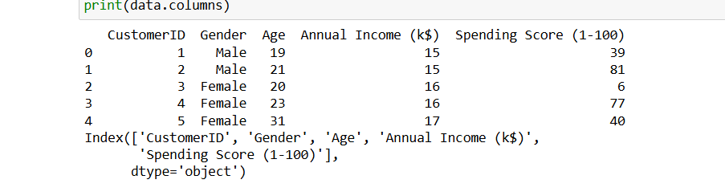
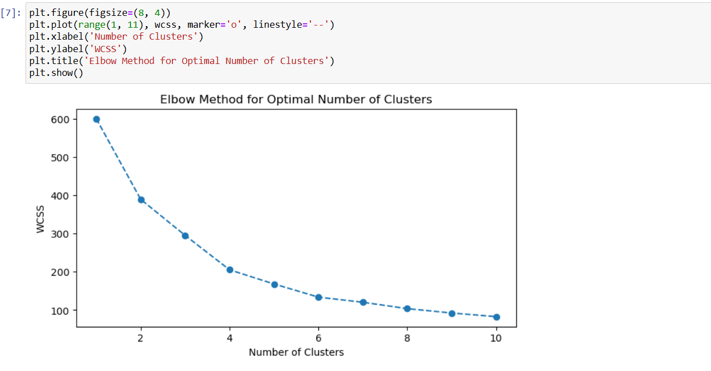
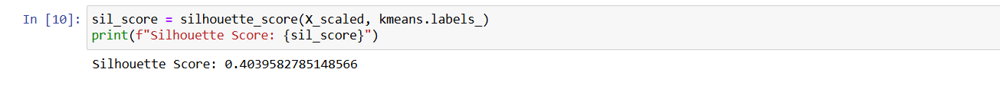
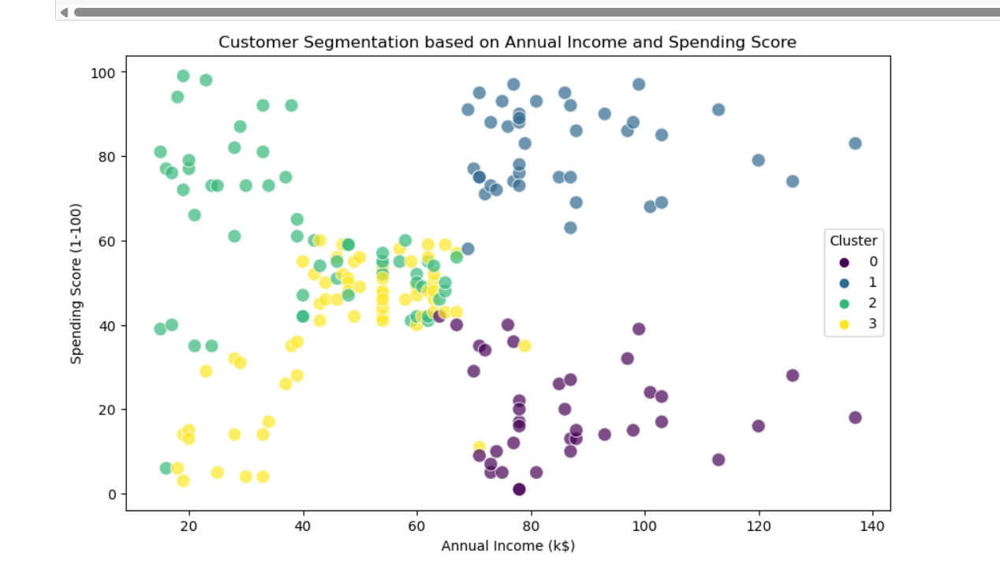

# BLENDED LEARNING
# Implementation of Customer Segmentation Using K-Means Clustering

## AIM:
To implement customer segmentation using K-Means clustering on the Mall Customers dataset to group customers based on purchasing habits.

## Equipments Required:
1. Hardware – PCs
2. Anaconda – Python 3.7 Installation / Jupyter notebook

## Algorithm
1. Import required libraries such as pandas, matplotlib, seaborn, and scikit-learn modules.

2. Load the dataset CustomerData.csv using read_csv() and display the first few rows and columns.

3. Select relevant features (Age, Annual Income (k$), Spending Score (1-100)) for clustering.

4. Standardize the selected features using StandardScaler to normalize the data.

5. Initialize an empty list to store WCSS (Within-Cluster Sum of Squares) values.

6. Apply K-Means clustering for cluster numbers from 1 to 10 and store inertia values to determine optimal clusters.

7. Plot the Elbow Method graph to identify the optimal number of clusters.

8. Choose the optimal number of clusters (e.g., 4) and fit the K-Means model on scaled data.

9. Assign cluster labels to the dataset and compute the Silhouette Score to evaluate clustering performance.

10. Visualize the clusters using a scatter plot based on Annual Income and Spending Score. 

## Program:
```
/*
Program to implement customer segmentation using K-Means clustering on the Mall Customers dataset.
Developed by: Sree Varsha D

import pandas as pd
import matplotlib.pyplot as plt
import seaborn as sns
from sklearn.cluster import KMeans
from sklearn.preprocessing import StandardScaler
from sklearn.metrics import silhouette_score


data = pd.read_csv("CustomerData.csv")


print(data.head())
print(data.columns)


features = ['Age', 'Annual Income (k$)', 'Spending Score (1-100)']
X = data[features]


scaler = StandardScaler()
X_scaled = scaler.fit_transform(X)


wcss = [] 
for i in range(1, 11):
    kmeans = KMeans(n_clusters=i, random_state=42)
    kmeans.fit(X_scaled)
    wcss.append(kmeans.inertia_)


plt.figure(figsize=(8, 4))
plt.plot(range(1, 11), wcss, marker='o', linestyle='--')
plt.xlabel('Number of Clusters')
plt.ylabel('WCSS')
plt.title('Elbow Method for Optimal Number of Clusters')
plt.show()


optimal_clusters = 4
kmeans = KMeans(n_clusters=optimal_clusters, random_state=42)
kmeans.fit(X_scaled)


data['Cluster'] = kmeans.labels_


sil_score = silhouette_score(X_scaled, kmeans.labels_)
print(f"Silhouette Score: {sil_score}")

plt.figure(figsize=(10, 6))
sns.scatterplot(data=data, x='Annual Income (k$)', y='Spending Score (1-100)', hue='Cluster', palette='viridis', s=100, alpha=0.7)
plt.title('Customer Segmentation based on Annual Income and Spending Score')
plt.xlabel('Annual Income (k$)')
plt.ylabel('Spending Score (1-100)')
plt.legend(title='Cluster')
plt.show()


RegisterNumber:  212225040422
*/
```

## Output:







## Result:
Thus, customer segmentation was successfully implemented using K-Means clustering, grouping customers into distinct segments based on their annual income and spending score. 
